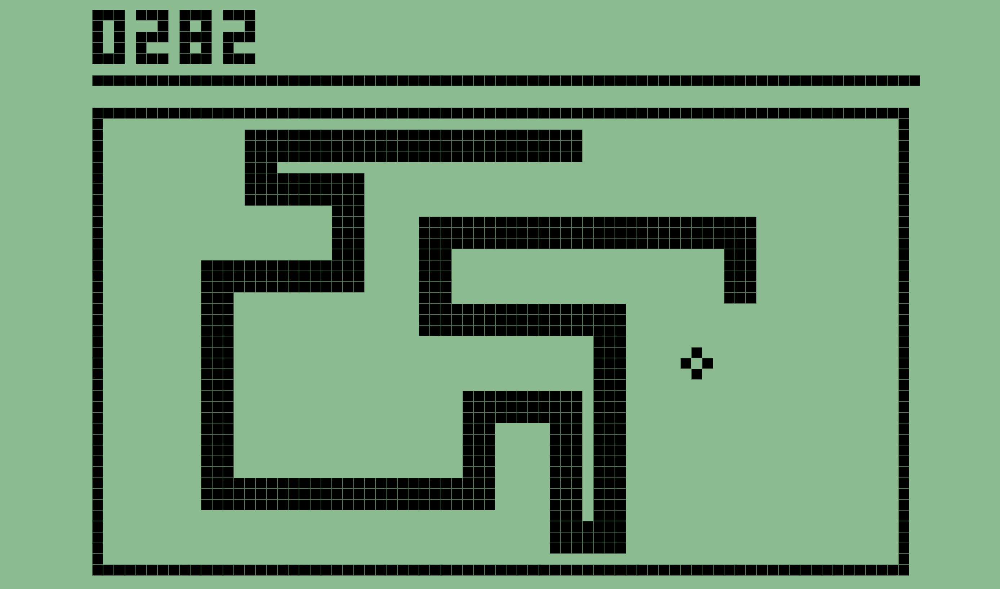
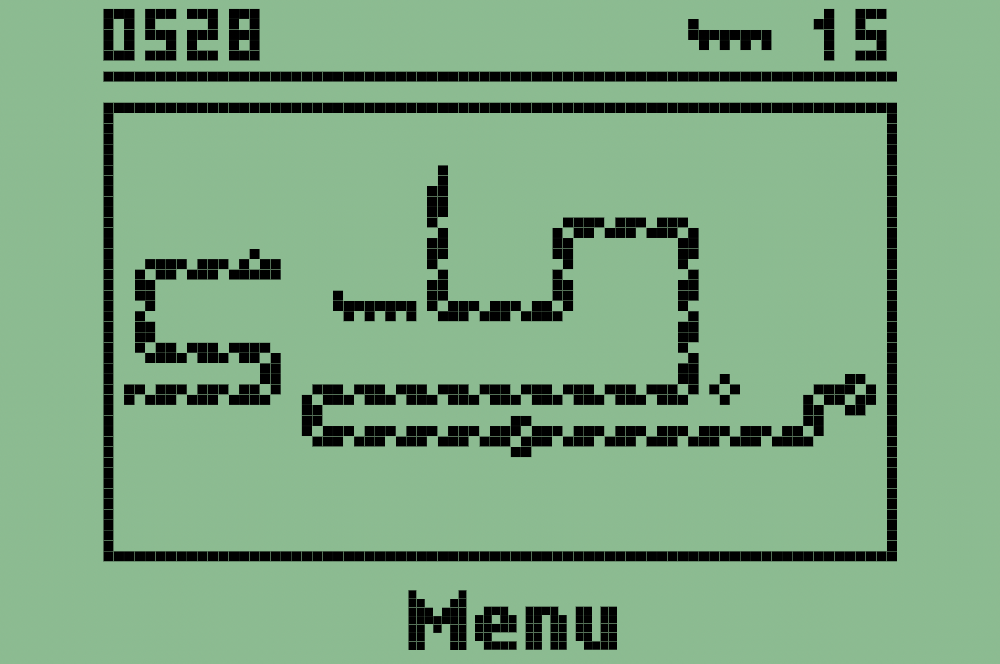

# 🐍 Nokia Snake I & II
\* *  *Technologies used include* ***React***, ***JavaScript***, ***HTML***, *and* ***CSS***. * * 

<!--  -->
When I first got the snake to move, I heard within my soul the maniacal voice of Dr. Frankenstein, *"It's aliiiiiivee!!"*

And yet...

I wasn't satiated.

I needed it to look and feel the way I remembered it on a Nokia 3310. It was the O.G. mobile app, the Candy Crush of the early aughts, that crowned this little brick by Nokia king. I remember then being charmed by the level of detail the programmers put into it and the intuitive user experience they delivered. I never anticipated the challenge ahead translating what they did with some dozens of pixels now equipped with modern programming languages. Stripped of the luxury of downloading a font, I wrote code for each letter: lower and uppercase, bold and lite. The end product allows you to choose between a more classic Snake I or Snake II, where the snake gains its stripes, teleports through walls, offers varying levels of difficulty and feeds on bonus prey.

Click [here](https://nokia-snake-jupiter-desphy.vercel.app/) to demo!

## Site

### [Landing Page](https://nokia-snake-jupiter-desphy.vercel.app/)

### [Snake I](https://nokia-snake-jupiter-desphy.vercel.app/snake1)

### [Snake II](https://nokia-snake-jupiter-desphy.vercel.app/snake2)

## Features

- Responsive CSS, framing screen as a Nokia if on a phone in portrait mode.
- Animations and fonts created using HTML, Javascript, and CSS.
    1. No outsourced font.
    2. Only outsourced photo is the Nokia background image for mobile use. ...for now. 😉
- Hover and focus inverts colors to denote button.
- Levels in Snake II.

### Controls

- Controls via keyboard arrow keys, swipe gestures or "buttons."
- ***Space*** bar for 3-phase pause functionality:
    1. Bring to menu.
    2. Back to game. Snake not yet moving.
    3. Snake moving again.
- ***Esc*** Back to menu.
- Hover or ***tab*** key to focus on menu options.
  
## Contact Me
<!--  -->

## Acknowledgements

- useInterval() hook API by [Dan Abramov](https://overreacted.io/making-setinterval-declarative-with-react-hooks/).
